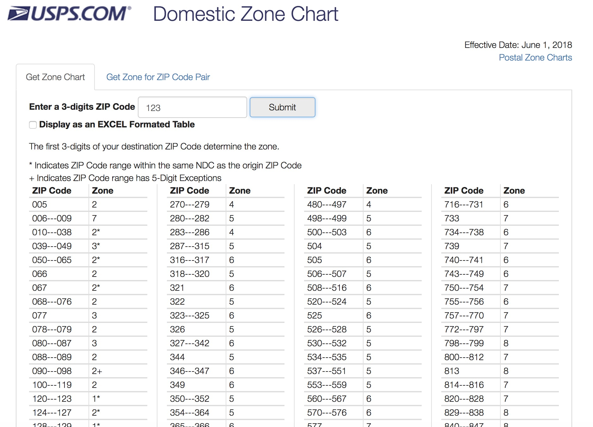

```{r setup, include = FALSE}
knitr::opts_chunk$set(
  collapse = TRUE,
  comment = "#>",
  fig.path = "man/figures/README-",
  out.width = "100%"
)
library(magrittr)
```

# usps `r emo::ji("mailbox")`

Need to get the USPS shipping zone for two zip codes? `usps` provides a tidy interface to the [USPS zone calc API](https://postcalc.usps.com/DomesticZoneChart/).

### Installation Instructions

```{r, eval=FALSE}
if (!require("devtools")) install.packages("devtools")
devtools::install_github('aedobbyn/usps')
```


<br>

<p align="center">
  
</p>


### Usage

Supply an origin and, optionally, a destination zip as character.

```{r}
library(usps)

fetch_zones(origin_zip = "123", 
            destination_zip = "581")
```


If no destination is supplied, all desination zips and their zones are returned.

<br>

#### Multiple zips

You can provide a vector of zips and map them nicely into a dataframe. 

If an origin zip is supplied that is not in use (see a list of these), it is messaged and included in the output with missing values in the other columns.

```{r}
origin_zips <- c("1", "007", "123")

origin_zips %>% 
  purrr::map_dfr(fetch_zones)
```


Map over both origin and destination zips and end up at a dataframe:

```{r}
dest_zips <- c("867", "53", "09")

purrr::map2_dfr(origin_zips, dest_zips, 
                fetch_zones)
```


<br>
<br>

#### Ranges and other features

The USPS web interface displays zones only as they pertain to destination zip code *ranges*:

<p align="center">
  
</p>


<br>

which you can ask for by setting `as_range = TRUE`. Instead of a `dest_zip` column, you'll get a marker of the beginning of and end of the range range in `dest_zip_start` and `dest_zip_end`.

<br>


You can optionally display other details about the zips, zones, and type of postage it applies to.

```{r}
fetch_zones("42", "42",
            as_range = TRUE, 
            show_details = TRUE)
```


<br>

If more than three digits are supplied, the zip is truncated to the first three with a warning.

```{r}
fetch_zones(origin_zip = "1235813213455", 
            destination_zip = "89144233377")
```

<br>

Bug reports and PRs welcome.

<p align="center">
  
</p>


