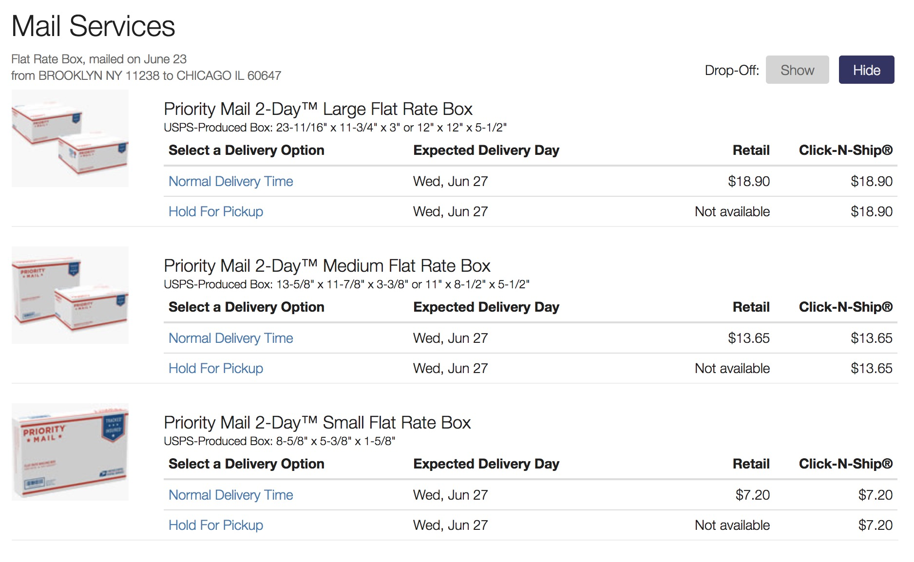
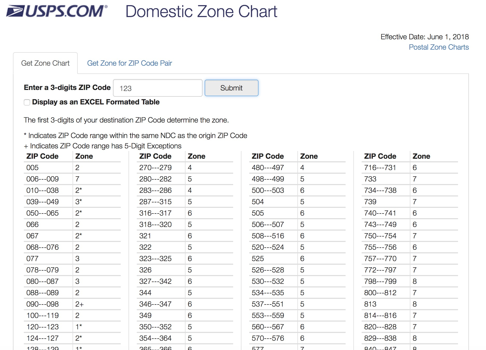

```{r setup, include = FALSE}
knitr::opts_chunk$set(
  collapse = TRUE,
  comment = "#>",
  fig.path = "man/figures/README-",
  out.width = "100%"
)
library(magrittr)
```

# usps `r emo::ji("mailbox")`

[](http://www.repostatus.org/#active)
[](https://travis-ci.org/aedobbyn/usps)
[](https://codecov.io/github/aedobbyn/usps?branch=master)

Want an estimate of the price of sending a package somewhere via the US Postal Service? Need to get the USPS shipping zone between two zip codes? 

Well, this is a `r emo::ji("package")` for your `r emo::ji("package")`s. `usps` provides a tidy interface to the USPS domestic [zone calc](https://postcalc.usps.com/DomesticZoneChart/) and [post calc](https://postcalc.usps.com/Calculator/) APIs. 

### Installation 

```{r, eval=FALSE}
# install.packages("devtools")
devtools::install_github("aedobbyn/usps")
```


<br>

<p align="center">
  
</p>


<br>

## Postage Price Calculator

There are two potage calculation functions: one for flat-rate envelopes and boxes (the kind you pick up at the post office and wrestle with until they fold into a box shape) or packages, which vary by their weight and dimensions.

### Usage

Specify a 5-digit origin zip and destination zip, along with the date and time you're going to be shipping (`"today"` and `"now` are allowed). 

```{r}
library(usps)
```

We'll ask for `type = "box"` and get back all the options for boxes along with their prices and dimensions. 

```{r}
fetch_mail_flat_rate(origin_zip = "11238", 
                     destination_zip = "60647",
                     shipping_date = "2018-06-25",
                     shipping_time = "now", 
                     type = "box")
```

The website should display the same results.

<p align="center">
  
</p>

USPS also offers some more colorful options to handle all your shipping needs. 

So to answer the burning question...what if we wanted to ship live animals from Wyoming to Philly by ground at 2:30pm in a nonrectangular package?? When will it get there and how much will it cost?

```{r}
fetch_mail_package(origin_zip = "88201", 
                   destination_zip = "19109", 
                   shipping_date = "today", 
                   shipping_time = "14:30", 
                   live_animals = TRUE,
                   ground_transportation_needed = TRUE,
                   pounds = 15,
                   ounces = 0,
                   length = 15,
                   width = 10,
                   height = 5,
                   girth = 7,
                   shape = "nonrectangular",
                   verbose = FALSE)
```


Finally, the important questions have been answered.

***

<br>

## Zones

A **zone** is a [representation of distance](https://ribbs.usps.gov/zone_charts/documents/tech_guides/ZoneChartExceptionsWebinar.pdf) between the origin and the destination zip codes. Zones are used in determining postage rates and delivery times. 

Sometimes you just need to know the shipping zone between your origin and destination. Or maybe between *all* origins and *all* destinations for some app you're building.

That doesn't sound so bad, but there are `99999^2` or 9,999,800,001 possible 5-digit origin-destination zip combinations in the US. Luckily, the USPS [Zone Calc](https://postcalc.usps.com/DomesticZoneChart/) tool narrows down that search space a bit by trimming zips to their first 3 digits.


### Usage

`fetch_zones_three_digit` lets you find the zone corresponding to a 3-digit origin zip prefix and one or many 3-digit destination zip prefixes.

```{r}
fetch_zones_three_digit(origin_zip = "123", 
            destination_zip = "581")
```


If no destination is supplied, all valid desination zips and zones are returned for the origin.

```{r}
fetch_zones_three_digit(origin_zip = "321")
```


<br>

#### Multiple zips

You can provide a vector of zips and map them nicely into a long dataframe. Here we ask for all destination zips for these three origin zips. 

If an origin zip is supplied that is [not in use](https://en.wikipedia.org/wiki/List_of_ZIP_code_prefixes), it is messaged and included in the output with `NA`s in the other columns. For example, the origin `"001"` is not a valid 3-digit zip prefix.


```{r}
origin_zips <- c("001", "271", "828")

origin_zips %>% 
  purrr::map_dfr(fetch_zones_three_digit)
```


Similarly, map over both origin and destination zips and end up at a dataframe. `verbose` gives you a play-by-play if you want it. (More on auto-prepending leading 0s to input zips in the [On Digits](https://github.com/aedobbyn/usps#on-digits) section below.)

```{r}
dest_zips <- c("867", "53", "09")

purrr::map2_dfr(origin_zips, dest_zips, 
                fetch_zones_three_digit,
                verbose = TRUE)
```


<br>
<br>

#### Ranges and other features

The USPS zone calc web interface displays zones only as they pertain to destination zip code *ranges*:

<p align="center">
  
</p>


<br>

If you prefer the range representation, you can set `as_range = TRUE`. Instead of a `dest_zip` column, you'll get a marker of the beginning of and end of the range in `dest_zip_start` and `dest_zip_end`.


```{r}
fetch_zones_three_digit("42", "42",
            as_range = TRUE)
```


<br>


### Details

You can optionally display other details about the zips, zones, and type of postage the zone designation applies to.

```{r}
fetch_zones_three_digit(origin_zip = "404",
            show_details = TRUE)  
```


Definitions of these details can be found in `zone_detail_definitions`.

```{r}
zone_detail_definitions %>% 
  knitr::kable()
```


<br>

### On Digits

The API endpoint used in `fetch_zones_three_digit` accepts exactly 3 digits for the origin zip; it mostly returns 3 digit destination zips, but also some 5 digit exceptions. For that reason,

* If *fewer than 3 digits* are supplied, leading zeroes are added with a message
  * e.g. `"8"` becomes `"008"`
* If *more than 5 digits* are supplied, the zip is truncated to the first 5 with a warning
  * If the zip is an origin, only the first 3 of those 5 digits are sent to the API
  * If the zip is a destination, the `exact_destination` flag determines whether we results for the that destination's 3-digit prefix filter or filter to only the exact 5-digit destination

For example, when a 5-digit destination is supplied and `exact_destination` is `FALSE`, we include results for the destination `962` as well as for the exact one supplied, `96240`.

```{r}
fetch_zones_three_digit(origin_zip = "12358132134558", 
            destination_zip = "96240",
            exact_destination = FALSE)     
```

When `exact_destination` is `TRUE`, we filter only to `96240`, which is a 5 digit exception as its zone is different from its 3-digit prefix's.

```{r}
fetch_zones_three_digit(origin_zip = "12358132134558", 
            destination_zip = "96240",
            exact_destination = TRUE)  
```


<br>

#### I just want to supply 5 digits

`fetch_zones_three_digit` should cover most 5 digit cases and supply the most information when `show_details` is `TRUE`. 
But if you just want to use the equivalent of the ["Get Zone for ZIP Code Pair"](https://postcalc.usps.com/DomesticZoneChart/) tab, you can use `fetch_zones_five_digit`.

```{r}
fetch_zones_five_digit("31415", "92653")
```

Details given when `show_details = TRUE` in `fetch_zones_five_digit` are slightly different than they are for `fetch_zones_three_digit` (see [Details](https://github.com/aedobbyn/usps#details)).

<br>


### All of the data

If you want the most up-to-date zip-zone mappings, `fetch_all` allows you to use the 3 digit endpoint to fetch all possible origins and, optionally, write them to a CSV as you go.

By default we use every possible origin from `"000"` to `"999"`; as of now `"000"` through `"004"` are all not in use along with a smattering of others like `"404"` and `"867"` -- but who knows, they might be used in the future.

```{r, eval=FALSE}
fetch_all(all_possible_origins,
          sleep_time = 0.5,   # How long to sleep in between requests, on average
          write_to = "path/to/my/file.csv")
```


If there's a network error when grabbing a zip, we back off and try a few times and finally write `"no_success"` (rather than `NA`s which indicate that the origin zip is not in use) in the destination zip columns. 

What that looks like in the event we switch on the internet between asking for origin `"456"` and origin `"789"`: 

```{r, echo=FALSE}
tibble::tribble(
  ~"origin_zip", ~"dest_zip", ~"zone",
  "123", "no_success", "no_success",
  "456", "no_success", "no_success",
  "789", "005", "7",
  "789", "006", "8",
  "789", "007", "8",
  "789", "008", "8",
  "789", "009", "8",
  "789", "010", "7",
  "...", "...", "..."
)
```


<br>

#### Well, not all of it

The `zips_zones` dataset included in this package contains a random sample of 1,000,000 rows of all the 3 digit origin-destination pairs. Load it with:

```{r}
data(zips_zones)
```


It's what you'd get by running `fetch_all(show_details = TRUE)`, waiting a while, and then taking a sample.

```{r}
zips_zones
```


The sample is about a quarter of the total number of rows between all origin prefixes and all destination prefixes, plus the 5 digit exceptions (3,804,494 rows). See it put to use in the [vignette](https://github.com/aedobbyn/usps/blob/dev/vignettes/getting-zoned.Rmd).

<br>

That's it! [Bug reports](https://github.com/aedobbyn/usps/issues) and PRs welcome! `r emo::ji("mailbox_with_mail")`

<p align="center">
  
</p>


