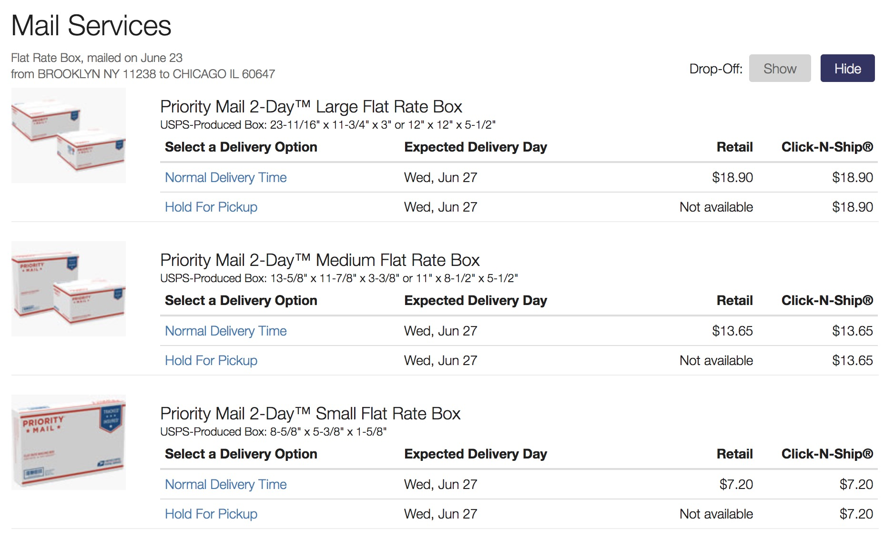
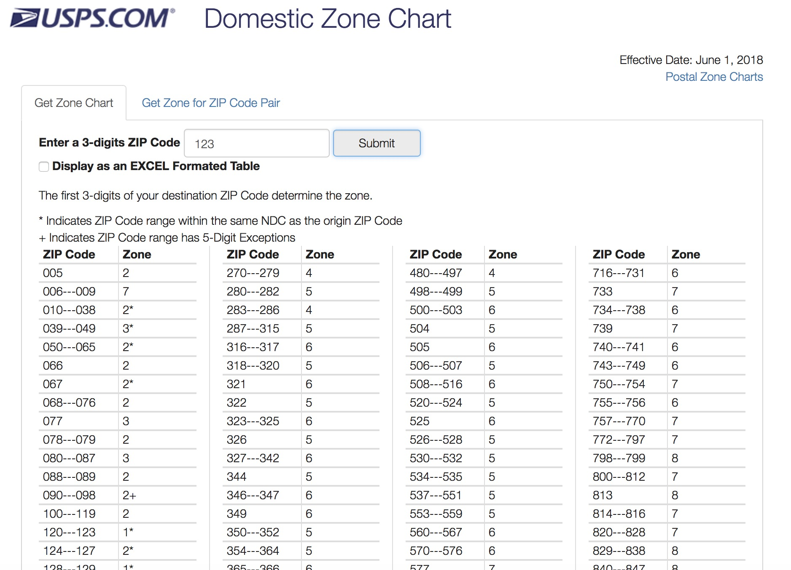

# usps 📫

[](http://www.repostatus.org/#active)
[](https://travis-ci.org/aedobbyn/usps)
[](https://codecov.io/github/aedobbyn/usps?branch=master)

Want an estimate of the price of sending a package somewhere via the US
Postal Service? Need to get the USPS shipping zone between two zip
codes?

Well, this is a 📦 for your 📦s. `usps` provides a tidy interface to the
USPS domestic [zone calc](https://postcalc.usps.com/DomesticZoneChart/)
and [post calc](https://postcalc.usps.com/Calculator/) APIs.

### Installation

``` r
# install.packages("devtools")
devtools::install_github("aedobbyn/usps")
```

<br>

<p align="center">


</p>

<br>

## Postage Price Calculator

There are two potage calculation functions: one for flat-rate envelopes
and boxes (the kind you pick up at the post office and wrestle with
until they fold into a box shape) or packages, which vary by their
weight and dimensions.

### Usage

Specify a 5-digit origin zip and destination zip, along with the date
and time you’re going to be shipping (`"today"` and `"now` are allowed).

``` r
library(usps)
```

We’ll ask for `type = "box"` and get back all the options for boxes
along with their prices and dimensions.

``` r
fetch_mail_flat_rate(origin_zip = "11238", 
                     destination_zip = "60647",
                     shipping_date = "2018-06-25",
                     shipping_time = "now", 
                     type = "box")
#> Using ship on time 15:31.
#> Requesting https://postcalc.usps.com/Calculator/GetMailServices?countryID=0&countryCode=US&origin=11238&isOrigMil=False&destination=60647&isDestMil=False&shippingDate=2018%2F06%2F25&shippingTime=15%3A31&itemValue=&dayOldPoultry=False&groundTransportation=False&hazmat=False&liveAnimals=False&nonnegotiableDocument=False&mailShapeAndSize=FlatRateBox&pounds=0&ounces=0&length=0&height=0&width=0&girth=0&shape=Rectangular&nonmachinable=False&isEmbedded=False
#> # A tibble: 6 x 7
#>   origin_zip dest_zip title     delivery_day retail_price click_n_ship_pr…
#>   <chr>      <chr>    <chr>     <chr>        <chr>        <chr>           
#> 1 11238      60647    Priority… Wed, Jun 27  $18.90       $18.90          
#> 2 11238      60647    Priority… Wed, Jun 27  Not availab… $18.90          
#> 3 11238      60647    Priority… Wed, Jun 27  $13.65       $13.65          
#> 4 11238      60647    Priority… Wed, Jun 27  Not availab… $13.65          
#> 5 11238      60647    Priority… Wed, Jun 27  $7.20        $7.20           
#> 6 11238      60647    Priority… Wed, Jun 27  Not availab… $7.20           
#> # ... with 1 more variable: dimensions <chr>
```

The website should display the same results.

<p align="center">



</p>

USPS also offers some more colorful options to handle all your shipping
needs.

So to answer the burning question…what if we wanted to ship live animals
from Wyoming to Philly by ground at 2:30pm in a nonrectangular package??
When will it get there and how much will it cost?

``` r
fetch_mail_package(origin_zip = "88201", 
                   destination_zip = "19109", 
                   shipping_date = "today", 
                   shipping_time = "14:30", 
                   live_animals = TRUE,
                   ground_transportation_needed = TRUE,
                   pounds = 15,
                   ounces = 0,
                   length = 15,
                   width = 10,
                   height = 5,
                   girth = 7,
                   shape = "nonrectangular",
                   verbose = FALSE)
#> # A tibble: 1 x 7
#>   origin_zip dest_zip title     delivery_day retail_price click_n_ship_pr…
#>   <chr>      <chr>    <chr>     <chr>        <chr>        <chr>           
#> 1 88201      19109    USPS Ret… Mon, Jul 2   $42.24       Not available   
#> # ... with 1 more variable: dimensions <chr>
```

Finally, the important questions have been answered.

#### Multiple inputs and error handling

These functions work on a single origin and single destination, but
multiple can be mapped into a tidy dataframe.

By default we try the API 3 times before giving up. You can modify that
by changing `n_tries`. If after `n_tries` we still have an error (here,
`"foo"` and `"bar"` are not good zips), a `"no_success"` row is returned
so that we don’t error out on the first failure.

``` r
origins <- c("11238", "foo", "60647", "80222")
destinations <- c("98109", "94707", "bar", "04123")

purrr::map2_dfr(
  origins, destinations,
  fetch_mail_flat_rate,
  type = "box",
  n_tries = 3,
  verbose = TRUE
)
#> Using ship on date 2018-06-25.
#> Using ship on time 15:31.
#> Requesting https://postcalc.usps.com/Calculator/GetMailServices?countryID=0&countryCode=US&origin=11238&isOrigMil=False&destination=98109&isDestMil=False&shippingDate=2018%2F06%2F25&shippingTime=15%3A31&itemValue=&dayOldPoultry=False&groundTransportation=False&hazmat=False&liveAnimals=False&nonnegotiableDocument=False&mailShapeAndSize=FlatRateBox&pounds=0&ounces=0&length=0&height=0&width=0&girth=0&shape=Rectangular&nonmachinable=False&isEmbedded=False
#> Using ship on date 2018-06-25.
#> Using ship on time 15:31.
#> Requesting https://postcalc.usps.com/Calculator/GetMailServices?countryID=0&countryCode=US&origin=foo&isOrigMil=False&destination=94707&isDestMil=False&shippingDate=2018%2F06%2F25&shippingTime=15%3A31&itemValue=&dayOldPoultry=False&groundTransportation=False&hazmat=False&liveAnimals=False&nonnegotiableDocument=False&mailShapeAndSize=FlatRateBox&pounds=0&ounces=0&length=0&height=0&width=0&girth=0&shape=Rectangular&nonmachinable=False&isEmbedded=False
#> Error on request. Beginning try 2 of 3.
#> Error on request. Beginning try 3 of 3.
#> Unsuccessful grabbing data for the supplied arguments.
#> Using ship on date 2018-06-25.
#> Using ship on time 15:31.
#> Requesting https://postcalc.usps.com/Calculator/GetMailServices?countryID=0&countryCode=US&origin=60647&isOrigMil=False&destination=bar&isDestMil=False&shippingDate=2018%2F06%2F25&shippingTime=15%3A31&itemValue=&dayOldPoultry=False&groundTransportation=False&hazmat=False&liveAnimals=False&nonnegotiableDocument=False&mailShapeAndSize=FlatRateBox&pounds=0&ounces=0&length=0&height=0&width=0&girth=0&shape=Rectangular&nonmachinable=False&isEmbedded=False
#> Error on request. Beginning try 2 of 3.
#> Error on request. Beginning try 3 of 3.
#> Unsuccessful grabbing data for the supplied arguments.
#> Using ship on date 2018-06-25.
#> Using ship on time 15:32.
#> Requesting https://postcalc.usps.com/Calculator/GetMailServices?countryID=0&countryCode=US&origin=80222&isOrigMil=False&destination=04123&isDestMil=False&shippingDate=2018%2F06%2F25&shippingTime=15%3A32&itemValue=&dayOldPoultry=False&groundTransportation=False&hazmat=False&liveAnimals=False&nonnegotiableDocument=False&mailShapeAndSize=FlatRateBox&pounds=0&ounces=0&length=0&height=0&width=0&girth=0&shape=Rectangular&nonmachinable=False&isEmbedded=False
#> # A tibble: 14 x 7
#>    origin_zip dest_zip title    delivery_day retail_price click_n_ship_pr…
#>    <chr>      <chr>    <chr>    <chr>        <chr>        <chr>           
#>  1 11238      98109    Priorit… Wed, Jun 27  $18.90       $18.90          
#>  2 11238      98109    Priorit… Wed, Jun 27  Not availab… $18.90          
#>  3 11238      98109    Priorit… Wed, Jun 27  $13.65       $13.65          
#>  4 11238      98109    Priorit… Wed, Jun 27  Not availab… $13.65          
#>  5 11238      98109    Priorit… Wed, Jun 27  $7.20        $7.20           
#>  6 11238      98109    Priorit… Wed, Jun 27  Not availab… $7.20           
#>  7 foo        94707    no_succ… no_success   no_success   no_success      
#>  8 60647      bar      no_succ… no_success   no_success   no_success      
#>  9 80222      04123    Priorit… Wed, Jun 27  $18.90       $18.90          
#> 10 80222      04123    Priorit… Wed, Jun 27  Not availab… $18.90          
#> 11 80222      04123    Priorit… Wed, Jun 27  $13.65       $13.65          
#> 12 80222      04123    Priorit… Wed, Jun 27  Not availab… $13.65          
#> 13 80222      04123    Priorit… Wed, Jun 27  $7.20        $7.20           
#> 14 80222      04123    Priorit… Wed, Jun 27  Not availab… $7.20           
#> # ... with 1 more variable: dimensions <chr>
```

-----

<br>

## Zones

A **zone** is a [representation of
distance](https://ribbs.usps.gov/zone_charts/documents/tech_guides/ZoneChartExceptionsWebinar.pdf)
between the origin and the destination zip codes. Zones are used in
determining postage rates and delivery times.

Sometimes you just need to know the shipping zone between your origin
and destination. Or maybe between *all* origins and *all* destinations
for some app you’re building.

That doesn’t sound so bad, but there are `99999^2` or 9,999,800,001
possible 5-digit origin-destination zip combinations in the US. Luckily,
the USPS [Zone Calc](https://postcalc.usps.com/DomesticZoneChart/) tool
narrows down that search space a bit by trimming zips to their first 3
digits.

### Usage

`fetch_zones_three_digit` lets you find the zone corresponding to a
3-digit origin zip prefix and one or many 3-digit destination zip
prefixes.

``` r
fetch_zones_three_digit(origin_zip = "123", 
            destination_zip = "581")
#> # A tibble: 1 x 3
#>   origin_zip dest_zip zone 
#>   <chr>      <chr>    <chr>
#> 1 123        581      6
```

If no destination is supplied, all valid desination zips and zones are
returned for the origin.

``` r
fetch_zones_three_digit(origin_zip = "321")
#> # A tibble: 2,422 x 3
#>    origin_zip dest_zip zone 
#>    <chr>      <chr>    <chr>
#>  1 321        005      5    
#>  2 321        006      6    
#>  3 321        007      6    
#>  4 321        008      6    
#>  5 321        009      6    
#>  6 321        010      5    
#>  7 321        011      5    
#>  8 321        012      5    
#>  9 321        013      6    
#> 10 321        014      6    
#> # ... with 2,412 more rows
```

<br>

#### Multiple zips

You can provide a vector of zips and map them nicely into a long
dataframe. Here we ask for all destination zips for these three origin
zips.

If an origin zip is supplied that is [not in
use](https://en.wikipedia.org/wiki/List_of_ZIP_code_prefixes), it is
messaged and included in the output with `NA`s in the other columns. For
example, the origin `"001"` is not a valid 3-digit zip prefix.

``` r
origin_zips <- c("001", "271", "828")

origin_zips %>% 
  purrr::map_dfr(fetch_zones_three_digit)
#> Origin zip 001 is not in use.
#> # A tibble: 4,845 x 3
#>    origin_zip dest_zip zone 
#>    <chr>      <chr>    <chr>
#>  1 001        <NA>     <NA> 
#>  2 271        005      4    
#>  3 271        006      7    
#>  4 271        007      7    
#>  5 271        008      7    
#>  6 271        009      7    
#>  7 271        010      4    
#>  8 271        011      4    
#>  9 271        012      4    
#> 10 271        013      4    
#> # ... with 4,835 more rows
```

Similarly, map over both origin and destination zips and end up at a
dataframe. `verbose` gives you a play-by-play if you want it. (More on
auto-prepending leading 0s to input zips in the [On
Digits](https://github.com/aedobbyn/usps#on-digits) section below.)

``` r
dest_zips <- c("867", "53", "09")

purrr::map2_dfr(origin_zips, dest_zips, 
                fetch_zones_three_digit,
                verbose = TRUE)
#> Grabbing origin ZIP 001
#> Origin zip 001 is not in use.
#> Making 53 into 053
#> Grabbing origin ZIP 271
#> Recieved 994 destination ZIPs for 8 zones.
#> Making 09 into 009
#> Grabbing origin ZIP 828
#> Recieved 994 destination ZIPs for 8 zones.
#> # A tibble: 3 x 3
#>   origin_zip dest_zip zone 
#>   <chr>      <chr>    <chr>
#> 1 001        <NA>     <NA> 
#> 2 271        053      5    
#> 3 828        009      8
```

<br> <br>

#### Ranges and other features

The USPS zone calc web interface displays zones only as they pertain to
destination zip code *ranges*:

<p align="center">



</p>

<br>

If you prefer the range representation, you can set `as_range = TRUE`.
Instead of a `dest_zip` column, you’ll get a marker of the beginning of
and end of the range in `dest_zip_start` and `dest_zip_end`.

``` r
fetch_zones_three_digit("42", "42",
            as_range = TRUE)
#> # A tibble: 1 x 4
#>   origin_zip dest_zip_start dest_zip_end zone 
#>   <chr>      <chr>          <chr>        <chr>
#> 1 042        039            043          1
```

<br>

### Details

You can optionally display other details about the zips, zones, and type
of postage the zone designation applies to.

``` r
fetch_zones_three_digit(origin_zip = "404",
            show_details = TRUE)  
#> # A tibble: 2,422 x 6
#>    origin_zip dest_zip zone  specific_to_prior… same_ndc has_five_digit_e…
#>    <chr>      <chr>    <chr> <lgl>              <lgl>    <lgl>            
#>  1 404        005      4     FALSE              FALSE    FALSE            
#>  2 404        006      7     FALSE              FALSE    FALSE            
#>  3 404        007      7     FALSE              FALSE    FALSE            
#>  4 404        008      7     FALSE              FALSE    FALSE            
#>  5 404        009      7     FALSE              FALSE    FALSE            
#>  6 404        010      5     FALSE              FALSE    FALSE            
#>  7 404        011      5     FALSE              FALSE    FALSE            
#>  8 404        012      5     FALSE              FALSE    FALSE            
#>  9 404        013      5     FALSE              FALSE    FALSE            
#> 10 404        014      5     FALSE              FALSE    FALSE            
#> # ... with 2,412 more rows
```

Definitions of these details can be found in `zone_detail_definitions`.

``` r
zone_detail_definitions %>% 
  knitr::kable()
```

| name                         | digit\_endpoint  | definition                                                                   |
| :--------------------------- | :--------------- | :--------------------------------------------------------------------------- |
| specific\_to\_priority\_mail | 3, 5             | This zone designation applies to Priority Mail only.                         |
| same\_ndc                    | 3, 5             | The origin and destination zips are in the same Network Distribution Center. |
| has\_five\_digit\_exceptions | 3                | This 3 digit destination zip prefix appears at the \\                        |
| beginning of certain 5 d     | igit destination | zips that correspond to a different zone.                                    |
| local                        | 5                | Is this a local zone?                                                        |
| full\_response               | 5                | Prose API response for these two 5-digit zips.                               |

<br>

### On Digits

The API endpoint used in `fetch_zones_three_digit` accepts exactly 3
digits for the origin zip; it mostly returns 3 digit destination zips,
but also some 5 digit exceptions. For that reason,

  - If *fewer than 3 digits* are supplied, leading zeroes are added with
    a message
      - e.g. `"8"` becomes `"008"`
  - If *more than 5 digits* are supplied, the zip is truncated to the
    first 5 with a warning
      - If the zip is an origin, only the first 3 of those 5 digits are
        sent to the API
      - If the zip is a destination, the `exact_destination` flag
        determines whether we results for the that destination’s 3-digit
        prefix filter or filter to only the exact 5-digit destination

For example, when a 5-digit destination is supplied and
`exact_destination` is `FALSE`, we include results for the destination
`962` as well as for the exact one supplied, `96240`.

``` r
fetch_zones_three_digit(origin_zip = "12358132134558", 
            destination_zip = "96240",
            exact_destination = FALSE)     
#> Warning in prep_zip(., verbose = verbose): Zip can be at most 5 characters;
#> trimming 12358132134558 to 12358.
#> # A tibble: 2 x 3
#>   origin_zip dest_zip zone 
#>   <chr>      <chr>    <chr>
#> 1 123        962      8    
#> 2 123        96240    5
```

When `exact_destination` is `TRUE`, we filter only to `96240`, which is
a 5 digit exception as its zone is different from its 3-digit prefix’s.

``` r
fetch_zones_three_digit(origin_zip = "12358132134558", 
            destination_zip = "96240",
            exact_destination = TRUE)  
#> Warning in prep_zip(., verbose = verbose): Zip can be at most 5 characters;
#> trimming 12358132134558 to 12358.
#> # A tibble: 1 x 3
#>   origin_zip dest_zip zone 
#>   <chr>      <chr>    <chr>
#> 1 123        96240    5
```

<br>

#### I just want to supply 5 digits

`fetch_zones_three_digit` should cover most 5 digit cases and supply the
most information when `show_details` is `TRUE`. But if you just want to
use the equivalent of the [“Get Zone for ZIP Code
Pair”](https://postcalc.usps.com/DomesticZoneChart/) tab, you can use
`fetch_zones_five_digit`.

``` r
fetch_zones_five_digit("31415", "92653")
#> # A tibble: 1 x 3
#>   origin_zip dest_zip zone 
#>   <chr>      <chr>    <chr>
#> 1 31415      92653    8
```

Details given when `show_details = TRUE` in `fetch_zones_five_digit` are
slightly different than they are for `fetch_zones_three_digit` (see
[Details](https://github.com/aedobbyn/usps#details)).

<br>

### All of the data

If you want the most up-to-date zip-zone mappings, `fetch_all` allows
you to use the 3 digit endpoint to fetch all possible origins and,
optionally, write them to a CSV as you go.

By default we use every possible origin from `"000"` to `"999"`; as of
now `"000"` through `"004"` are all not in use along with a smattering
of others like `"404"` and `"867"` – but who knows, they might be used
in the future.

``` r
fetch_all(all_possible_origins,
          sleep_time = 0.5,   # How long to sleep in between requests, on average
          write_to = "path/to/my/file.csv")
```

If there’s a network error when grabbing a zip, we back off and try a
few times and finally write `"no_success"` (rather than `NA`s which
indicate that the origin zip is not in use) in the destination zip
columns.

What that looks like in the event we switch on the internet between
asking for origin `"456"` and origin `"789"`:

    #> # A tibble: 9 x 3
    #>   origin_zip dest_zip   zone      
    #>   <chr>      <chr>      <chr>     
    #> 1 123        no_success no_success
    #> 2 456        no_success no_success
    #> 3 789        005        7         
    #> 4 789        006        8         
    #> 5 789        007        8         
    #> 6 789        008        8         
    #> 7 789        009        8         
    #> 8 789        010        7         
    #> 9 ...        ...        ...

<br>

#### Well, not all of it

The `zips_zones` dataset included in this package contains a random
sample of 1,000,000 rows of all the 3 digit origin-destination pairs.
Load it with:

``` r
data(zips_zones)
```

It’s what you’d get by running `fetch_all(show_details = TRUE)`, waiting
a while, and then taking a sample.

``` r
zips_zones
#> # A tibble: 1,000,000 x 6
#>    origin_zip dest_zip  zone specific_to_prior… same_ndc has_five_digit_e…
#>    <chr>      <chr>    <int> <lgl>              <lgl>    <lgl>            
#>  1 003        <NA>        NA NA                 NA       NA               
#>  2 004        <NA>        NA NA                 NA       NA               
#>  3 005        012          2 FALSE              FALSE    FALSE            
#>  4 005        027          2 FALSE              FALSE    FALSE            
#>  5 005        028          2 FALSE              FALSE    FALSE            
#>  6 005        030          3 FALSE              FALSE    FALSE            
#>  7 005        042          3 FALSE              FALSE    FALSE            
#>  8 005        044          4 FALSE              FALSE    FALSE            
#>  9 005        051          3 FALSE              FALSE    FALSE            
#> 10 005        053          3 FALSE              FALSE    FALSE            
#> # ... with 999,990 more rows
```

The sample is about a quarter of the total number of rows between all
origin prefixes and all destination prefixes, plus the 5 digit
exceptions (3,804,494 rows). See it put to use in the
[vignette](https://github.com/aedobbyn/usps/blob/dev/vignettes/getting-zoned.Rmd).

<br>

That’s it\! [Bug reports](https://github.com/aedobbyn/usps/issues) and
PRs welcome\!
📬

<p align="center">


</p>
