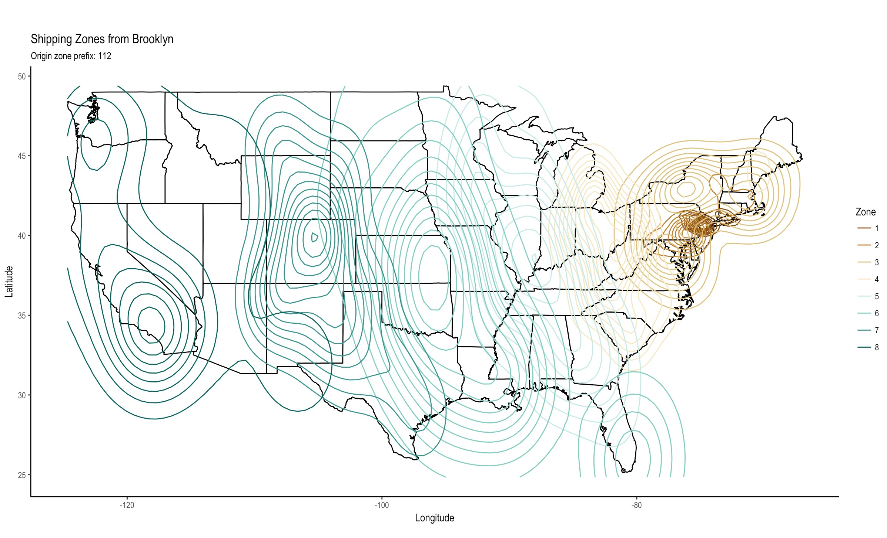

```{r setup, include = FALSE}
knitr::opts_chunk$set(
  collapse = TRUE,
  comment = "#>",
  cache = FALSE,
  out.width = "100%"
)
```

```{r load_pkgs, message=FALSE}
library(usps)
library(zipcode)
library(ggplot2)
library(dplyr)
library(tidyr)
```

The `usps::zips_zones` dataset provides a quarter of the ~4 million 3-digit origin-destination pairs. (If you want allll of them, you can run `fetch_all` and put on a pot of coffee.) 

What if we wanted to use that to plot how zones increase as the destination gets farther from the origin?

We'll need a measure of latitude and longitude for that. Luckily, data from the [`zipcode`](https://github.com/cran/zipcode) package relates every zip codes to its latitude and longitude. We can that along with  the *partial* data in `usps::zips_zones` to match up zips to latitudes and longitudes.

Let's load in the randomly sampled `usps` package data. 

```{r}
data(zips_zones)
zips_zones
```

Later we'll `select` away all the other details and focus just on `origin_zip`, `dest_zip`, and `zone`. As we know, the `usps::zip_zones` data displays all origin zips as 3 digit prefixes and most destination zips as 3 digits as well.

However, the `zipcode::zipcode` data displays zips in the usual way, as 5 digit. 

```{r}
data(zipcode)
zipcode %>% 
  as_tibble()
```


So we'll want to trim them in order to be able to join on our data, the majority of which are 3 digits.

```{r load_zips}
zips <- 
  zipcode %>% 
  as_tibble() %>% 
  mutate(
    zip_trim = substr(zip, 1, 3)
  )

zips
```

Let's get a tibble of all possible USPS zips, both origin prefixes and destinations, including our 5 digit destinations.

```{r usps_zips}
(usps_zips <-
  tibble(
    zip =
      unique(zips_zones$origin_zip) %>% 
      c(unique(zips_zones$dest_zip)) 
  ) %>% 
  distinct())
```


Now we can join the `zipcode` trimmed zips on our `usps_zips` to get a corresponding lat and long for each 3-digit origin and destination zip.

```{r zips_lat_long}
(zips_lat_long <- 
  zips %>% 
  distinct(zip_trim, .keep_all = TRUE) %>% 
  left_join(usps_zips, by = c("zip_trim" = "zip")) %>% 
  select(zip_trim, latitude, longitude))
```

Now we have a mapping between each possible 3 digit zip and its latitude and longitude. But for every row in our `zips_zones` dataset, we have two lats and two longs: one for the origin and one for the destination. 

So we'll want to take our `zips_lat_long` mapping and use that to attach latitude and longitude to each origin and each destination in `zips_zones`.

```{r zips_zones_lat_long}
(zips_zones_lat_long <- 
  zips_zones %>% 
  select(origin_zip, dest_zip, zone) %>% 
  left_join(zips_lat_long, by = c("origin_zip" = "zip_trim")) %>% 
  rename(
      lat_origin = latitude,
      long_origin = longitude) %>% 
  left_join(zips_lat_long, by = c("dest_zip" = "zip_trim")) %>% 
  rename(
      lat_dest = latitude,
      long_dest = longitude) %>% 
  drop_na(zone))
```


We could use the `ggmap` package to get a map of the US like

```{r, eval=FALSE}
get_googlemap("us", zoom = 4)
# or
get_map("us", zoom = 4, maptype = "toner-lite")
```

but to go simpler, we'll use `ggplot2`'s built-in `map_data` function.

```{r us_map}
us <- 
  map_data("state") %>%
  as_tibble() 
```


Now, using a single origin zip (112), we can plot all of the destination zips' zones relative to that origin. We'll also filter out any outliers.

```{r}
zz_filtered <- 
  zips_zones_lat_long %>% 
  filter(origin_zip == "112") %>% 
  left_join(us, by = c("lat_dest" = "lat", "long_dest" = "long")) %>% 
  filter(as.numeric(dest_zip) > 10 &
           long_dest < -50)
```

Remember -- always confusingly, to me, longitude is on the x and latitude is on the y (!)

The map should look fragmented as our `zip_zones` data only covers a quarter of the possible origin-destination pairs. Still, the pattern is clear: zones increase as your destination gets farther away `r emo::ji("tada")`

```{r zone_map, eval=FALSE, warning=FALSE}
ggplot() +
  geom_polygon(data = us, aes(x = long, y = lat, group = group), fill = "white", color = "black") +
  geom_density_2d(data = zz_filtered,
             aes(long_dest, lat_dest, colour = factor(zone)),
             alpha = 1) +
  labs(x = "Longitude", y = "Latitude", colour = "Zone") +
  ggtitle("Shipping Zones from Brooklyn",
          subtitle = "Origin zone prefix: 112") +
  scale_colour_brewer(type = "seq", palette = "BrBG") +
  theme_classic(base_family = "Arial Narrow") +
  coord_quickmap()
```

```{r, echo=FALSE}

```


<br>
